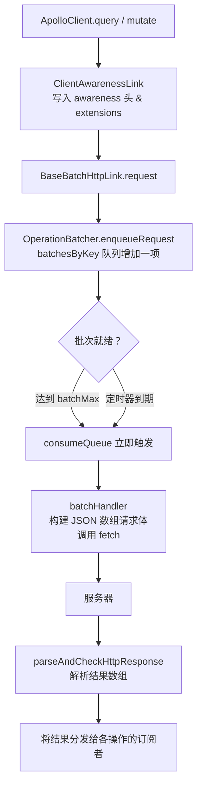

`BatchHttpLink` 是一个**终止型链接（terminating link）**，它自动将多个并发的
GraphQL 操作合并为一次 HTTP 请求一起发送。当页面挂载、多个组件同时独立发起请求时，
这可以显著减少网络往返次数。

本文在翻译原始文档的基础上，对每一个步骤的**数据如何变换**、**请求头如何演化**、
**队列（`batchesByKey`）如何变化**以及 **Awareness 是如何被感知并注入的**进行了
完整的拆解。

---

## 架构总览

`BatchHttpLink` 由三个协作层组成：

| 层                               | 文件                                         | 职责                                                              |
| -------------------------------- | -------------------------------------------- | ----------------------------------------------------------------- |
| `BatchHttpLink`                  | `src/link/batch-http/batchHttpLink.ts`       | 公开入口；将 `ClientAwarenessLink` 与 `BaseBatchHttpLink` 组合    |
| `BaseBatchHttpLink`              | `src/link/batch-http/BaseBatchHttpLink.ts`   | 创建序列化并发送批次的 `batchHandler`；持有批处理配置             |
| `BatchLink` / `OperationBatcher` | `src/link/batch/batchLink.ts`，`batching.ts` | 基于定时器的队列，负责将操作分组并在批次就绪时调用 `batchHandler` |



---

## 逐步深度拆解

### 第 1 步 — 链路组合：两个链接串联

```ts
// BatchHttpLink 构造函数（简化）
export class BatchHttpLink extends ApolloLink {
  constructor(options: BatchHttpLink.Options = {}) {
    const { left, right, request } = ApolloLink.from([
      new ClientAwarenessLink(options), // ① 写入 awareness 信息
      new BaseBatchHttpLink(options), // ② 处理批处理 + HTTP
    ]);
    super(request);
    Object.assign(this, { left, right });
  }
}
```

每个操作**首先**流经 `ClientAwarenessLink`（下一步详述），随后进入
`BaseBatchHttpLink`。

---

### 第 2 步 — ClientAwarenessLink：Awareness 是如何感知并注入的

**Awareness** 指的是将"哪个客户端、哪个版本"的信息附加到请求中，以便
Apollo Server 和 Apollo Studio 识别不同的客户端。

#### 2a — 感知来源（三层优先级，低 → 高）

```
ApolloClient 构造函数选项
  clientAwareness.name / .version
       ↓ 被下一层覆盖
BatchHttpLink / ClientAwarenessLink 构造函数选项
       ↓ 被下一层覆盖
operation.getContext().clientAwareness   ← 每次请求动态设置
```

在源码中，三层通过 `compact()` 合并（后者覆盖前者，忽略 `undefined`）：

```ts
const {
  name,
  version,
  transport = "headers",
} = compact(
  {},
  clientOptions.clientAwareness, // ApolloClient 构造函数
  options.clientAwareness, // 链接构造函数
  context.clientAwareness // 本次请求 context
);
```

#### 2b — 用户 Awareness：写入请求头

当 `transport === "headers"`（默认值）时，`ClientAwarenessLink` 调用
`operation.setContext()` 在操作的上下文中**预设**两个头：

```ts
operation.setContext(({ headers }) => ({
  headers: compact(
    {
      "apollographql-client-name": name, // 例如 "MyWebApp"
      "apollographql-client-version": version, // 例如 "2.1.0"
    },
    headers // 后续链路设置的 headers 可覆盖这两个值
  ),
}));
```

**头变化示例（设置前 → 设置后）：**

```
设置前（operation.context.headers）：
  {}

设置后：
  {
    "apollographql-client-name":    "MyWebApp",
    "apollographql-client-version": "2.1.0"
  }
```

> 注意：这里只是写入 `context.headers`，真正的 HTTP 请求头在第 6 步
> `selectHttpOptionsAndBodyInternal` 时才被合并到 `fetch` 的 `headers` 选项里。

#### 2c — 增强 Awareness（Apollo Client 库信息）：写入 extensions

当 `enhancedClientAwareness.transport === "extensions"`（默认值）时，
Apollo Client 库本身的名称和版本被写入 `operation.extensions`：

```ts
operation.extensions = compact(
  {
    clientLibrary: {
      name: "@apollo/client",
      version: "4.x.x", // 实际运行时的版本号
    },
  },
  operation.extensions // 用户自定义 extensions 可覆盖
);
```

**extensions 变化示例（设置前 → 设置后）：**

```
设置前（operation.extensions）：
  { "myCustomExt": true }

设置后：
  {
    "clientLibrary": { "name": "@apollo/client", "version": "4.x.x" },
    "myCustomExt": true
  }
```

经过 `ClientAwarenessLink` 后，operation 对象状态如下：

```
operation = {
  operationName: "GetUser",
  query: DocumentNode,
  variables: { id: "1" },
  extensions: {
    clientLibrary: { name: "@apollo/client", version: "4.x.x" }
  },
  context: {
    headers: {
      "apollographql-client-name":    "MyWebApp",
      "apollographql-client-version": "2.1.0"
    }
  }
}
```

---

### 第 3 步 — `BaseBatchHttpLink` 初始化：配置批处理参数

在 `BaseBatchHttpLink` 构造函数中，批处理参数被固化，
同时一个 `batchHandler` 闭包被创建（第 6 步执行），最后构造 `BatchLink`：

```ts
this.batchInterval = batchInterval || 10; // 等待窗口（毫秒）
this.batchMax = batchMax || 10; // 每批最多操作数

const batchHandler: BatchLink.BatchHandler = (operations) => {
  // 第 6 步——HTTP 请求在此构建
};

this.batcher = new BatchLink({
  batchDebounce: this.batchDebounce,
  batchInterval: this.batchInterval,
  batchMax: this.batchMax,
  batchKey,
  batchHandler,
});
```

**`batchKey` 函数**（默认实现）将 URI + 上下文配置序列化为字符串，
确保目标 endpoint 或 HTTP 选项不同的操作**永远不会混入同一批次**：

```ts
batchKey = (operation) => {
  const context = operation.getContext();
  const contextConfig = {
    http: context.http,
    options: context.fetchOptions,
    credentials: context.credentials,
    headers: context.headers,
  };
  return selectURI(operation, uri) + JSON.stringify(contextConfig);
  // 例如："https://api.example.com/graphql{\"headers\":{...}}"
};
```

---

### 第 4 步 — 操作入队：`OperationBatcher.enqueueRequest` 与队列状态变化

每次 `BatchLink.request()` 被调用，最终都会到达 `OperationBatcher.enqueueRequest()`。

#### 4a — 队列（`batchesByKey`）的数据结构

```
batchesByKey: Map<string, Set<QueuedRequest>>
              ─────┬─────   ──────┬──────────
                   │              └── 该 key 下排队的所有操作（按入队先后顺序）
                   └── batchKey(operation) 返回的字符串
```

每个 `QueuedRequest` 的结构：

```ts
type QueuedRequest = {
  operation: ApolloLink.Operation; // 原始操作对象
  forward: ApolloLink.ForwardFunction;
  observable?: Observable<Result>; // 返回给调用方的 Observable
  next: Array<(r: Result) => void>; // 所有订阅者的 next 回调
  error: Array<(e: Error) => void>; // 所有订阅者的 error 回调
  complete: Array<() => void>; // 所有订阅者的 complete 回调
  subscribers: Set<Observer>; // 当前订阅者集合
};
```

#### 4b — 队列随时间的变化（以两个操作为例）

假设 `batchInterval = 10ms`，`batchMax = 10`，两个组件分别在 t=0ms 和 t=3ms
调用 `useQuery`，产生操作 opA 和 opB：

```
t=0ms  opA 入队
────────────────────────────────────────────────────────
batchesByKey = {
  "https://api.example.com/graphql{...}": Set {
    QueuedRequest { operation: opA, next: [fnA], ... }
  }
}
scheduledBatchTimerByKey = {
  "https://api.example.com/graphql{...}": Timer(10ms)   ← 首个请求触发计时器
}

t=3ms  opB 入队（batchDebounce=false，不重置计时器）
────────────────────────────────────────────────────────
batchesByKey = {
  "https://api.example.com/graphql{...}": Set {
    QueuedRequest { operation: opA, next: [fnA], ... },
    QueuedRequest { operation: opB, next: [fnB], ... }
  }
}
scheduledBatchTimerByKey = {
  "https://api.example.com/graphql{...}": Timer(10ms)   ← 计时器保持不变
}

t=10ms  定时器到期 → consumeQueue() 被调用
────────────────────────────────────────────────────────
batchesByKey = {}                  ← Map 被清空（delete 后处理）
scheduledBatchTimerByKey = {}      ← 计时器被清除
→ 进入第 5 步：触发 batchHandler([opA, opB])
```

若在到达 `batchMax` 之前就积累了足够多的操作，`consumeQueue` 会**立即**被调用，
计时器也被取消：

```
t=0ms ~ t=2ms  10 个操作快速入队 → batch.size === batchMax(10)
→ 立即调用 consumeQueue()，不等待计时器
```

---

### 第 5 步 — `consumeQueue`：从队列到 batchHandler

`consumeQueue` 将 `Set<QueuedRequest>` 中的数据拆解为平行数组，再传入
`batchHandler`：

```ts
public consumeQueue(key: string): ... {
  const batch = this.batchesByKey.get(key);
  this.batchesByKey.delete(key);        // ① 立即从 Map 中移除，防止重复消费

  const operations = [];  // [opA, opB]
  const forwards   = [];  // [fwdA, fwdB]
  const nexts      = [];  // [[fnA_sub1], [fnB_sub1]]
  const errors     = [];  // [[errA_sub1], [errB_sub1]]
  const completes  = [];  // [[cmpA_sub1], [cmpB_sub1]]

  batch.forEach((req) => {
    operations.push(req.operation);
    forwards.push(req.forward);
    nexts.push(req.next);
    errors.push(req.error);
    completes.push(req.complete);
  });

  const batchedObservable = this.batchHandler(operations, forwards);
  // batchedObservable 发出 [ResultA, ResultB] 数组（第 7 步消费）
  batch.subscription = batchedObservable.subscribe({ next, error, complete });
}
```

---

### 第 6 步 — HTTP 请求构建：请求头的三层合并

`batchHandler` 内部调用 `selectHttpOptionsAndBodyInternal` 为**每个操作**
独立构建 fetch 选项，然后取第一个操作的 HTTP 选项作为本批次的公共 fetch 配置。

#### 6a — 三层优先级（低 → 高，后者覆盖前者）

```
第 1 层 fallbackHttpConfig（全局默认）
  headers: {
    accept:       "application/graphql-response+json,application/json;q=0.9",
    content-type: "application/json"
  }
  options: { method: "POST" }

第 2 层 linkConfig（BatchHttpLink 构造函数选项）
  headers: { authorization: "Bearer token" }  ← 仅当构造函数传入时
  credentials: "include"                        ← 仅当构造函数传入时

第 3 层 contextConfig（本次操作的 context，包含 ClientAwarenessLink 写入的头）
  headers: {
    "apollographql-client-name":    "MyWebApp",
    "apollographql-client-version": "2.1.0"
  }
```

#### 6b — 合并后的最终请求头示例

```
// 合并前（各层 headers）
fallback:  { accept: "...", "content-type": "application/json" }
link:      { authorization: "Bearer abc123" }
context:   {
             "apollographql-client-name":    "MyWebApp",
             "apollographql-client-version": "2.1.0"
           }

// 合并后（options.headers，传入 fetch）
{
  accept:                          "application/graphql-response+json,application/json;q=0.9",
  "content-type":                  "application/json",
  authorization:                   "Bearer abc123",
  "apollographql-client-name":     "MyWebApp",
  "apollographql-client-version":  "2.1.0"
}
```

> **优先级规则**：若同一个头在多层中都出现，**高优先级层（context）的值覆盖低
> 优先级层（link/fallback）的值**。`accept` 头是例外——各层的值被 `,` 连接，
> 并去除重复项。

#### 6c — 请求体（Body）的构建

每个操作的 body 对象结构如下（未使用变量会在 `includeUnusedVariables=false` 时被过滤）：

```ts
// 单个操作的 body
{
  operationName: "GetUser",
  query: "query GetUser($id: ID!) { user(id: $id) { id name } }",
  variables: { id: "1" },
  extensions: {
    clientLibrary: { name: "@apollo/client", version: "4.x.x" }
  }
}
```

将所有操作的 body 组成数组，序列化为 JSON 字符串后作为 `fetch` 的请求体：

```ts
const loadedBody = optsAndBody.map(({ body }) => body);
// loadedBody = [bodyA, bodyB]

options.body = JSON.stringify(loadedBody);
// '[{"operationName":"GetUser","query":"...","variables":{"id":"1"},...},
//   {"operationName":"GetPosts","query":"...","variables":{},...}]'
```

#### 6d — AbortController 与 fetch 调用

```ts
// 创建 AbortController，让订阅者可以取消正在进行的请求
const controller = new AbortController();
options.signal = controller.signal;

// fetch 优先级：构造函数 fetch 选项 > 全局 window.fetch > 模块加载时捕获的备用 fetch
const currentFetch = preferredFetch || maybe(() => fetch) || backupFetch;

currentFetch(chosenURI, options);
// 等价于：
// fetch("https://api.example.com/graphql", {
//   method: "POST",
//   headers: { /* 6b 中合并的头 */ },
//   body:    "[{...}, {...}]",
//   signal:  abortSignal,
//   credentials: "include",
// })
```

---

### 第 7 步 — 响应解析

`fetch` 返回后，经过两个 `.then` 处理：

```ts
currentFetch(chosenURI, options)
  .then((response) => {
    // ① 将原始 Response 对象写回每个操作的 context
    //    调用方可通过 operation.getContext().response 访问
    operations.forEach((op) => op.setContext({ response }));
    return response;
  })
  .then(parseAndCheckHttpResponse(operations))
  // ② 解析 JSON，校验：
  //    - 返回值是否为数组
  //    - 数组长度是否与 operations.length 一致
  //    - 每个元素是否是合法的 GraphQL response（含 data 或 errors）
  .then((result) => {
    // result = [{ data: { user: {...} } }, { data: { posts: [...] } }]
    observer.next(result);
    observer.complete();
  })
  .catch((err) => observer.error(err));
```

**数据变换示例（HTTP 响应 → 解析后的结果数组）：**

```
HTTP 响应体（原始 JSON 字符串）：
'[{"data":{"user":{"id":"1","name":"Alice"}}},{"data":{"posts":[{"id":"1","title":"Hello"}]}}]'

parseAndCheckHttpResponse 解析后：
[
  { data: { user: { id: "1", name: "Alice" } } },
  { data: { posts: [{ id: "1", title: "Hello" }] } }
]
```

---

### 第 8 步 — 结果分发：将批量结果派发给各个订阅者

`consumeQueue` 中，`batchedObservable`（即第 7 步的 Observable）被订阅后，
按索引将结果分发给对应操作的所有订阅者：

```ts
batch.subscription = batchedObservable.subscribe({
  next: (results) => {
    // results[0] → nexts[0]（opA 的所有订阅者的 next 回调）
    // results[1] → nexts[1]（opB 的所有订阅者的 next 回调）
    results.forEach((result, index) => {
      nexts[index].forEach((next) => next(result));
    });
  },
  error: (error) => {
    // HTTP 请求失败时，所有操作一起失败
    errors.forEach((rejecters) => rejecters.forEach((e) => e(error)));
  },
  complete: () => {
    completes.forEach((complete) => complete.forEach((c) => c()));
  },
});
```

**数据流向示例：**

```
batchedObservable 发出：
  [
    { data: { user: { id: "1", name: "Alice" } } },   ← index 0 → opA 的订阅者
    { data: { posts: [...] } }                         ← index 1 → opB 的订阅者
  ]

opA 的 Observable（useQuery 订阅的那个）收到：
  { data: { user: { id: "1", name: "Alice" } } }

opB 的 Observable 收到：
  { data: { posts: [...] } }
```

至此，每个操作的 `Observable`（在第 4 步 `enqueueRequest` 中返回）都收到了
各自的结果，完成了整个请求-响应循环。

---

## 完整时序图

```mermaid
sequenceDiagram
    participant App as App（React 组件）
    participant CL as ClientAwarenessLink
    participant BL as BaseBatchHttpLink
    participant OB as OperationBatcher
    participant Server

    App->>CL: request(opA)
    note over CL: 写入 context.headers:<br/>apollographql-client-name<br/>apollographql-client-version<br/>写入 extensions.clientLibrary
    CL->>BL: forward(opA)
    BL->>OB: enqueueRequest(opA)
    note over OB: batchesByKey.set(key, {opA})<br/>启动 10ms 定时器
    OB-->>App: Observable&lt;ResultA&gt;（opA 的订阅句柄）

    App->>CL: request(opB)
    CL->>BL: forward(opB)
    BL->>OB: enqueueRequest(opB)
    note over OB: batchesByKey = {key: {opA, opB}}<br/>定时器继续（非 debounce 模式）
    OB-->>App: Observable&lt;ResultB&gt;

    note over OB: 10ms 定时器到期 → consumeQueue()<br/>batchesByKey.delete(key)
    OB->>BL: batchHandler([opA, opB])
    note over BL: 合并 headers（三层）<br/>body = JSON.stringify([bodyA, bodyB])<br/>创建 AbortController
    BL->>Server: POST /graphql<br/>headers: { content-type, accept, apollographql-client-name, ... }<br/>body: [{query:A,...},{query:B,...}]
    Server-->>BL: [{data:A,...},{data:B,...}]
    note over BL: parseAndCheckHttpResponse<br/>校验数组长度 & 格式
    BL-->>OB: Observable 发出 [ResultA, ResultB]
    OB->>App: ResultA → opA 的所有 next 回调
    OB->>App: ResultB → opB 的所有 next 回调
```

---

## 配置参考

```ts
import { BatchHttpLink } from "@apollo/client/link/batch-http";

const link = new BatchHttpLink({
  // GraphQL 端点（默认："/graphql"）
  uri: "https://api.example.com/graphql",

  // 发送批次前最长等待时间，毫秒（默认：10）
  batchInterval: 20,

  // 为 true 时，每来一个新操作都重置定时器（默认：false）
  // 适用于用户快速连续触发的 mutation
  batchDebounce: false,

  // 每批最多操作数（默认：10）
  batchMax: 5,

  // 自定义分组函数：返回值相同的操作会被合并进同一批次。
  // 默认：uri + JSON.stringify({ http, fetchOptions, credentials, headers })
  batchKey: (operation) => {
    const ctx = operation.getContext();
    return ctx.headers?.["x-tenant-id"] ?? "default";
  },

  // 自定义 fetch 实现（默认：全局 fetch）
  fetch: customFetch,

  // 是否在请求体中包含 query 未引用的变量（默认：false）
  includeUnusedVariables: false,
});
```

---

## 实际示例

### 示例 1 — 基础用法

将 `HttpLink` 替换为 `BatchHttpLink`：

```ts
import { ApolloClient, InMemoryCache } from "@apollo/client";
import { BatchHttpLink } from "@apollo/client/link/batch-http";

const client = new ApolloClient({
  cache: new InMemoryCache(),
  link: new BatchHttpLink({
    uri: "https://api.example.com/graphql",
    batchMax: 5, // 每批最多 5 个操作
    batchInterval: 20, // 最多等待 20ms
  }),
});
```

当三个组件同时调用 `useQuery`，Apollo Client 会将它们合并为一次网络请求：

```json
// 单次 HTTP POST 请求体：
[
  { "query": "query GetUser { user { id name } }" },
  { "query": "query GetPosts { posts { id title } }" },
  { "query": "query GetComments { comments { id body } }" }
]

// 单次 HTTP 响应：
[
  { "data": { "user": { "id": "1", "name": "Alice" } } },
  { "data": { "posts": [{ "id": "1", "title": "Hello" }] } },
  { "data": { "comments": [] } }
]
```

### 示例 2 — 与其他链接组合

`BatchHttpLink` 是终止型链接，必须放在链路的最末端：

```ts
import { ApolloClient, InMemoryCache, ApolloLink } from "@apollo/client";
import { BatchHttpLink } from "@apollo/client/link/batch-http";
import { onError } from "@apollo/client/link/error";
import { setContext } from "@apollo/client/link/context";

const authLink = setContext((_, { headers }) => ({
  headers: {
    ...headers,
    authorization: `Bearer ${localStorage.getItem("token")}`,
  },
}));

const errorLink = onError(({ graphQLErrors, networkError }) => {
  if (networkError) console.error("网络错误：", networkError);
});

const batchLink = new BatchHttpLink({
  uri: "https://api.example.com/graphql",
  batchMax: 10,
  batchInterval: 15,
});

const client = new ApolloClient({
  cache: new InMemoryCache(),
  link: ApolloLink.from([errorLink, authLink, batchLink]),
});
```

### 示例 3 — 多租户场景下的自定义 `batchKey`

使用 `batchKey` 确保不同租户的操作永远不会混入同一批次：

```ts
const link = new BatchHttpLink({
  uri: "https://api.example.com/graphql",
  batchKey: (operation) => {
    const tenantId = operation.getContext().headers?.["x-tenant-id"] ?? "";
    return `${operation.getContext().uri ?? "/graphql"}|${tenantId}`;
  },
});
```

### 示例 4 — 防抖模式下的 Mutation 合并

当 UI 连续快速触发 mutation（如自动保存表单）时，使用防抖让最后一次触发才实际发送：

```ts
const link = new BatchHttpLink({
  uri: "https://api.example.com/graphql",
  batchDebounce: true, // 每来一个新操作都重置定时器
  batchInterval: 50, // 等待 50ms 静默期后再发送
  batchMax: 20,
});
```

### 示例 5 — 让单个操作跳过批处理

通过自定义中间链接，为特定操作生成独一无二的 `batchKey`，使其不被合并：

```ts
import { ApolloLink } from "@apollo/client";

const skipBatchingLink = new ApolloLink((operation, forward) => {
  if (operation.getContext().skipBatching) {
    operation.setContext({
      // 唯一 key 确保该操作永远不会与其他操作分到同一批次
      batchKey: `skip-${Date.now()}-${Math.random()}`,
    });
  }
  return forward(operation);
});

// 在组件中使用
useQuery(URGENT_QUERY, {
  context: { skipBatching: true },
});
```

---

## 服务端要求

你的 GraphQL 服务器必须支持批量请求——即接受 JSON 数组作为请求体，并按**相同顺序**
返回 JSON 数组结果。

开箱即用支持批量请求的服务器：

- [Apollo Server](https://www.apollographql.com/docs/apollo-server)（默认启用）
- [GraphQL Yoga](https://the-guild.dev/graphql/yoga-server)
- [Mercurius](https://mercurius.dev/)

> **注意：** `BatchHttpLink` 不支持 HTTP GET 请求，所有批量请求均使用 POST。

---

## 与 `HttpLink` 的对比

| 特性                   | `HttpLink` | `BatchHttpLink`       |
| ---------------------- | ---------- | --------------------- |
| 每个操作的请求数       | 1          | 每批 1 次（多个操作） |
| GET 支持               | ✅         | ❌                    |
| 响应流（`@defer`）     | ✅         | ❌                    |
| Client Awareness       | ✅         | ✅                    |
| 减少网络往返           | ❌         | ✅                    |
| 需要服务端支持批量请求 | ❌         | ✅                    |

当你希望减少网络往返次数且服务端支持批量请求时，使用 `BatchHttpLink`。
当你需要 GET 支持、`@defer`/`@stream` 响应流，或服务端不支持批量请求时，使用 `HttpLink`。
