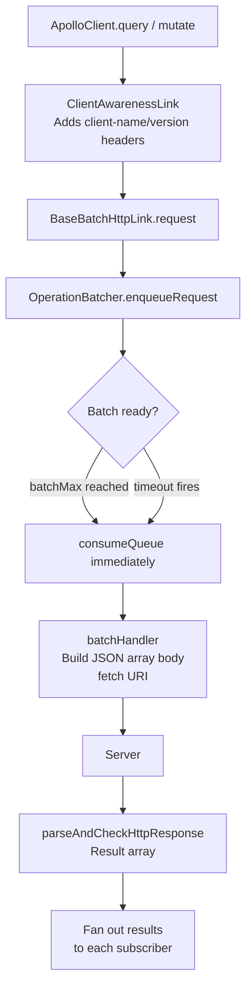
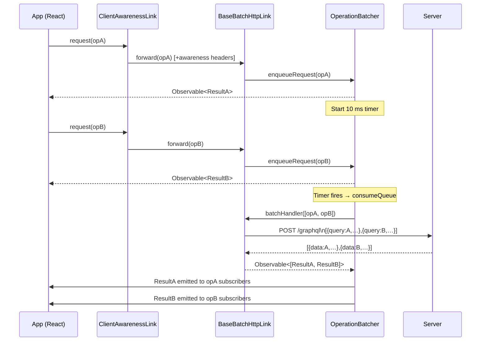

`BatchHttpLink` is a terminating link that automatically groups multiple
concurrent GraphQL operations and sends them together as a single HTTP request.
This reduces network overhead when several queries or mutations fire at the same
time—for example, when a page mounts and each component independently requests
data.

## Architecture overview

`BatchHttpLink` is composed of three collaborating layers:

| Layer | File | Responsibility |
|---|---|---|
| `BatchHttpLink` | `src/link/batch-http/batchHttpLink.ts` | Public entry-point; combines `ClientAwarenessLink` and `BaseBatchHttpLink` |
| `BaseBatchHttpLink` | `src/link/batch-http/BaseBatchHttpLink.ts` | Creates the `batchHandler` that serializes & fetches a batch; owns batching configuration |
| `BatchLink` / `OperationBatcher` | `src/link/batch/batchLink.ts`, `batching.ts` | Timer-based queue that groups incoming operations and calls `batchHandler` when the batch is ready |



---

## Step-by-step implementation walk-through

### Step 1 — The link chain composes two links

```ts
// BatchHttpLink constructor (simplified)
export class BatchHttpLink extends ApolloLink {
  constructor(options: BatchHttpLink.Options = {}) {
    const { left, right, request } = ApolloLink.from([
      new ClientAwarenessLink(options),  // adds awareness headers
      new BaseBatchHttpLink(options),    // handles batching + HTTP
    ]);
    super(request);
    Object.assign(this, { left, right });
  }
}
```

Every operation first flows through `ClientAwarenessLink`, which attaches
optional `apollographql-client-name` / `apollographql-client-version` headers
and an `extensions.clientLibrary` object to the operation. It then forwards to
`BaseBatchHttpLink`.

---

### Step 2 — `BaseBatchHttpLink` configures and creates a `BatchLink`

During construction, `BaseBatchHttpLink` stores the batching parameters and
defines a `batchHandler` closure. It then creates a `BatchLink` that will call
this handler when a batch of operations is ready.

```ts
// Key parameters with defaults
this.batchInterval = batchInterval || 10;  // ms to wait before flushing
this.batchMax      = batchMax      || 10;  // max operations per batch

const batchHandler: BatchLink.BatchHandler = (operations) => {
  // Step 5 – HTTP request construction happens here
};

this.batcher = new BatchLink({
  batchDebounce: this.batchDebounce,
  batchInterval: this.batchInterval,
  batchMax:      this.batchMax,
  batchKey,
  batchHandler,
});
```

The **`batchKey`** function (defaulting to `uri + JSON.stringify(contextConfig)`)
groups operations that share the same endpoint and HTTP options.  Operations
destined for different endpoints are kept in separate queues and are never
mixed.

---

### Step 3 — Operations enter the queue (`OperationBatcher.enqueueRequest`)

Every call to `BatchLink.request()` reaches `OperationBatcher.enqueueRequest()`.

```ts
public enqueueRequest(request): Observable<Result> {
  const key = this.batchKey(request.operation);

  // Lazy-create the per-key batch (a Set of QueuedRequests)
  let batch = this.batchesByKey.get(key);
  if (!batch) this.batchesByKey.set(key, (batch = new Set()));

  // Add this subscriber's callbacks to the queued request
  const requestCopy = { ...request, next: [], error: [], complete: [], subscribers: new Set() };
  batch.add(requestCopy);

  // First request in batch → schedule the flush timer
  if (isFirstEnqueuedRequest || this.batchDebounce) {
    this.scheduleQueueConsumption(key);
  }

  // Already reached the limit → flush immediately
  if (batch.size === this.batchMax) {
    this.consumeQueue(key);
  }

  return requestCopy.observable;
}
```

The returned `Observable` is what the caller (`useQuery`, `useMutation`, etc.)
subscribes to.  It is backed by the `next/error/complete` callback arrays, which
are populated later when the batched response arrives.

---

### Step 4 — Timer and `batchMax` trigger `consumeQueue`

```ts
private scheduleQueueConsumption(key: string): void {
  clearTimeout(this.scheduledBatchTimerByKey.get(key));
  this.scheduledBatchTimerByKey.set(
    key,
    setTimeout(() => {
      this.consumeQueue(key);
      this.scheduledBatchTimerByKey.delete(key);
    }, this.batchInterval)   // default 10 ms
  );
}
```

There are two flush triggers:

| Trigger | When |
|---|---|
| **Timer** (throttle) | `batchInterval` ms after the *first* request arrived. All requests that arrived within that window are included. |
| **Timer** (debounce) | `batchInterval` ms after the *most recent* request. Enabled with `batchDebounce: true`. Useful for mutations triggered by rapid user input. |
| **`batchMax`** | Immediately when the queue reaches `batchMax` operations. |

---

### Step 5 — HTTP request construction (`batchHandler`)

`consumeQueue` invokes `batchHandler(operations, forwards)`.  Inside that
closure, `BaseBatchHttpLink`:

1. **Selects the URI** from the first operation's context (or falls back to the
   `uri` option).
2. **Builds per-operation options and body** by calling
   `selectHttpOptionsAndBodyInternal` for each operation, layering options from
   lowest to highest priority: `fallbackHttpConfig` → link constructor options →
   per-operation context.
3. **Filters unused variables** (when `includeUnusedVariables` is `false`, the
   default) to keep the payload lean.
4. **Rejects GET requests** — there is no standard for batched GET requests.
5. **Serializes all bodies** as a JSON array and sets it as the `fetch` body:
   ```ts
   options.body = JSON.stringify(loadedBody); // e.g. [{query:…,variables:…},{query:…}]
   ```
6. **Creates an `AbortController`** so the in-flight request can be cancelled
   when the subscriber unsubscribes.
7. **Calls `fetch`**, preferring the `fetch` option passed to the constructor, then
   the global `fetch`, then a module-level backup captured at load time.

---

### Step 6 — Response parsing

After `fetch` resolves, the response is processed:

```ts
currentFetch(chosenURI, options)
  .then((response) => {
    // Make the raw Response available via operation.getContext().response
    operations.forEach((op) => op.setContext({ response }));
    return response;
  })
  .then(parseAndCheckHttpResponse(operations))  // parses JSON, validates shape
  .then((result) => {
    observer.next(result);   // result is an array: [data1, data2, …]
    observer.complete();
  })
  .catch((err) => observer.error(err));
```

`parseAndCheckHttpResponse` validates that the server returned an array of the
correct length and that each element is a valid GraphQL response.

---

### Step 7 — Result fan-out to individual subscribers

Back in `OperationBatcher.consumeQueue`, the `batchedObservable` is subscribed:

```ts
batch.subscription = batchedObservable.subscribe({
  next: (results) => {
    // results[0] → nexts[0] (operation 0's subscribers)
    // results[1] → nexts[1] (operation 1's subscribers)
    results.forEach((result, index) => {
      nexts[index].forEach((next) => next(result));
    });
  },
  error: (error) => {
    // All operations fail together when the HTTP request fails
    errors.forEach((rejecters) => rejecters.forEach((e) => e(error)));
  },
  complete: () => {
    completes.forEach((complete) => complete.forEach((c) => c()));
  },
});
```

Each operation's `Observable` (returned in Step 3) now receives its individual
result, completing the round-trip.

---

## Complete flow diagram



---

## Configuration reference

```ts
import { BatchHttpLink } from "@apollo/client/link/batch-http";

const link = new BatchHttpLink({
  // GraphQL endpoint (default: "/graphql")
  uri: "https://api.example.com/graphql",

  // Max milliseconds to wait before sending the batch (default: 10)
  batchInterval: 20,

  // When true, resets the timer on every new operation (default: false)
  // Useful for mutations triggered by rapid user interaction
  batchDebounce: false,

  // Maximum operations in a single batch (default: 10)
  batchMax: 5,

  // Custom function to determine which operations can be batched together.
  // Operations with the same key are batched together.
  // Default: uri + JSON.stringify({ http, fetchOptions, credentials, headers })
  batchKey: (operation) => {
    const ctx = operation.getContext();
    return ctx.headers?.["x-tenant-id"] ?? "default";
  },

  // Custom fetch implementation (default: global fetch)
  fetch: customFetch,

  // Whether to include variables not referenced in the query (default: false)
  includeUnusedVariables: false,
});
```

---

## Practical examples

### Example 1 — Basic setup

Replace `HttpLink` with `BatchHttpLink` in the Apollo Client constructor:

```ts
import { ApolloClient, InMemoryCache } from "@apollo/client";
import { BatchHttpLink } from "@apollo/client/link/batch-http";

const client = new ApolloClient({
  cache: new InMemoryCache(),
  link: new BatchHttpLink({
    uri: "https://api.example.com/graphql",
    batchMax: 5,       // send up to 5 operations per request
    batchInterval: 20, // wait 20 ms for more operations to arrive
  }),
});
```

When the app mounts and three components call `useQuery` simultaneously, Apollo
Client batches all three into one network request:

```
// Single HTTP POST body:
[
  { "query": "query GetUser { user { id name } }" },
  { "query": "query GetPosts { posts { id title } }" },
  { "query": "query GetComments { comments { id body } }" }
]

// Single HTTP response:
[
  { "data": { "user": { "id": "1", "name": "Alice" } } },
  { "data": { "posts": [{ "id": "1", "title": "Hello" }] } },
  { "data": { "comments": [] } }
]
```

### Example 2 — Combining with other links

`BatchHttpLink` is a terminating link and must be the last link in the chain:

```ts
import { ApolloClient, InMemoryCache, ApolloLink } from "@apollo/client";
import { BatchHttpLink } from "@apollo/client/link/batch-http";
import { onError } from "@apollo/client/link/error";
import { setContext } from "@apollo/client/link/context";

const authLink = setContext((_, { headers }) => ({
  headers: {
    ...headers,
    authorization: `Bearer ${localStorage.getItem("token")}`,
  },
}));

const errorLink = onError(({ graphQLErrors, networkError }) => {
  if (networkError) console.error("Network error:", networkError);
});

const batchLink = new BatchHttpLink({
  uri: "https://api.example.com/graphql",
  batchMax: 10,
  batchInterval: 15,
});

const client = new ApolloClient({
  cache: new InMemoryCache(),
  link: ApolloLink.from([errorLink, authLink, batchLink]),
});
```

### Example 3 — Per-tenant batching with a custom `batchKey`

Use `batchKey` to ensure that operations for different tenants are never mixed
into the same batch:

```ts
const link = new BatchHttpLink({
  uri: "https://api.example.com/graphql",
  batchKey: (operation) => {
    const tenantId = operation.getContext().headers?.["x-tenant-id"] ?? "";
    return `${operation.getContext().uri ?? "/graphql"}|${tenantId}`;
  },
});
```

### Example 4 — Debounced batching for mutations

When your UI triggers many mutations in quick succession (e.g., auto-saving a
form), debounce the batch so that only the last burst is sent:

```ts
const link = new BatchHttpLink({
  uri: "https://api.example.com/graphql",
  batchDebounce: true, // reset the timer on every new operation
  batchInterval: 50,   // wait 50 ms of silence before flushing
  batchMax: 20,
});
```

### Example 5 — Opting individual operations out of batching

Set `context.skipBatching` by using a custom middleware link that assigns each
operation its own unique `batchKey`:

```ts
import { ApolloLink } from "@apollo/client";

const skipBatchingLink = new ApolloLink((operation, forward) => {
  if (operation.getContext().skipBatching) {
    operation.setContext({
      // Use a unique key so this operation is never grouped with others
      batchKey: `skip-${Date.now()}-${Math.random()}`,
    });
  }
  return forward(operation);
});

// Usage in a component
useQuery(URGENT_QUERY, {
  context: { skipBatching: true },
});
```

---

## Server-side requirements

Your GraphQL server must support batch requests—i.e., it must accept a JSON
array as the request body and return a JSON array of results **in the same
order**.

Popular servers that support this out of the box:

- [Apollo Server](https://www.apollographql.com/docs/apollo-server) (enabled by default)
- [GraphQL Yoga](https://the-guild.dev/graphql/yoga-server)
- [Mercurius](https://mercurius.dev/)

> **Note:** `BatchHttpLink` does not support HTTP GET requests. All batched
> requests use POST.

---

## Comparison with `HttpLink`

| Feature | `HttpLink` | `BatchHttpLink` |
|---|---|---|
| Requests per operation | 1 | 1 per batch (multiple operations) |
| GET support | ✅ | ❌ |
| Response streaming (`@defer`) | ✅ | ❌ |
| Client awareness | ✅ | ✅ |
| Reduces round-trips | ❌ | ✅ |
| Requires server batch support | ❌ | ✅ |

Use `BatchHttpLink` when you want to reduce the number of network round-trips
and your server supports batched requests. Use `HttpLink` when you need GET
support, response streaming with `@defer`/`@stream`, or a server that does not
support batch requests.
